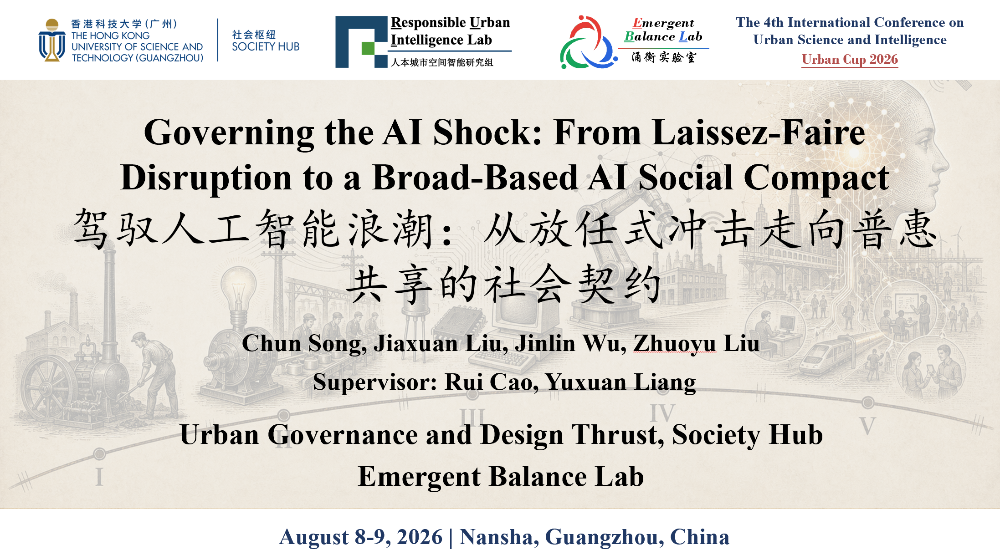
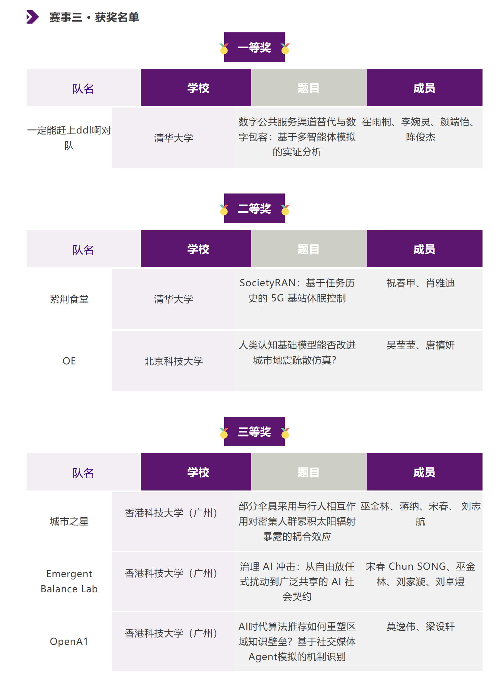
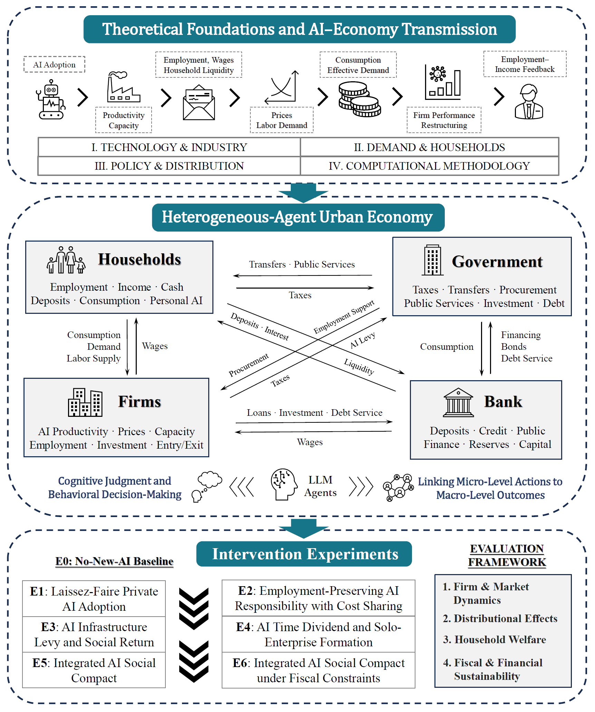

# Governing the AI Shock

<p align="center">
  
</p>

<p align="center">
  <strong>Urban Cup 2026 Third Prize（三等奖）</strong><br>
  The 4th International Conference on Urban Science and Intelligence<br>
  Hong Kong University of Science and Technology (Guangzhou)
</p>

This repository contains the reproducible simulation code and usage
instructions for *Governing the AI Shock: From Laissez-Faire Disruption to a
Broad-Based AI Social Compact*, a Third Prize project in Urban Cup 2026. The
model studies employment, firm dynamics, household welfare, and public-policy
responses under an AI productivity shock by combining a deterministic economic
core with optional, bounded AgentSociety/LLM decisions for residents, firms,
and government.

## Urban Cup 2026 recognition

The project appears in the official competition results under the Third Prize
category as the Emergent Balance Lab entry, “治理 AI 冲击：从自由放任式扰动到广泛共享的
AI 社会契约.”

<p align="center">
  
</p>

## Research framework

The framework links AI adoption to a heterogeneous-agent urban economy,
bounded LLM-assisted decisions, six post-shock intervention scenarios, and a
four-part evaluation framework.

<p align="center">
  
</p>

## Repository layout

```text
ai_economy_execution/          Python package and test suite
  config/baseline.json         Baseline calibration
  custom/                      AgentSociety agent and environment modules
  reporting/                   Dataset and figure-generation tools
  tests/                       Offline unit and research-pipeline tests
INSTITUTIONAL_EXPERIMENTS.md   E2-E6 design and evidence boundaries
requirements.txt              Runtime dependencies
```

Generated results are intentionally excluded from version control.

## Quick start

The commands below are intended for Linux/macOS or WSL and have been verified
with Python 3.12.

```bash
git clone https://github.com/Shyr0796/governing-the-ai-shock.git
cd governing-the-ai-shock

python3 -m venv .venv
source .venv/bin/activate
python -m pip install --upgrade pip
python -m pip install -r requirements.txt
```

Run a small network-free smoke simulation:

```bash
python -m ai_economy_execution.run \
  --scenario E5 --population 100 --months 36 --seed 1 \
  --scenario-definition-version institutional_v2 \
  --provider offline --llm-roles "" --cognitive-regime R0 \
  --result-stage smoke
```

Run the test suite without sending API requests:

```bash
AGENTSOCIETY_LLM_API_KEY=test-no-network \
python -m unittest discover -s ai_economy_execution/tests -v
```

Results are written below `ai_economy_execution/results/` unless an explicit
output path is supplied.

## Optional LLM providers

LLM decisions are optional. Offline R0 runs require no API key and make no API
request. For an LLM-backed run, export exactly the key required by the selected
provider:

| Provider | Environment variable | Default model |
|---|---|---|
| `hkust` | `HKUST_API_KEY` | `gpt-4` |
| `deepseek` | `DEEPSEEK_API_KEY` | `deepseek-chat` |
| `dashscope` | `DASHSCOPE_API_KEY` | `qwen-plus` |
| `moonshot` | `MOONSHOT_API_KEY` | `moonshot-v1-8k` |
| `openai` | `OPENAI_API_KEY` | `gpt-4.1-mini` |

Validate configuration without making a network request:

```bash
python -m ai_economy_execution.api_preflight \
  --provider hkust --llm-roles government
```

Before a paid run, inspect the complete matrix plan without `--execute`:

```bash
python -m ai_economy_execution.cognitive_matrix_suite \
  --population 100 --months 36 --seeds 1 \
  --regimes R0-R3 --scenarios E0-E6 \
  --provider hkust --model gpt-3.5-turbo \
  --result-stage smoke
```

Only add `--execute` after reviewing the plan, loading the provider key, and
starting with a small pilot.

## Scenario semantics

- `E0-E1` provide the baseline/no-shock and ungoverned-shock comparisons.
- `E2` preserves employment while sharing temporary wage costs and reducing
  required work hours.
- `E3` applies a graduated levy to bounded AI productivity rents and recycles
  the revenue.
- `E4` models incubation and voluntary solo-enterprise formation.
- `E5` combines the institutional portfolio.
- `E6` applies the same portfolio with explicit deficit and debt limits.

The default scenario version is `institutional_v2`. Historical
`legacy_v1` E5/E6 outputs must not be pooled with it. See
[INSTITUTIONAL_EXPERIMENTS.md](INSTITUTIONAL_EXPERIMENTS.md) for the exact
design, qualification gates, and interpretation limits.

## Further usage

The package-level [extended guide](ai_economy_execution/USAGE.md) documents:

- AgentSociety runs and counterfactual suites;
- the R0-R3 by E0-E6 matrix layout;
- offline calibration and common-random-number experiments;
- sensitivity analysis and the complete formal study;
- audit manifests, behavior qualification, and reporting tools.

This repository contains research software. A successful smoke run verifies
execution and artifact structure; it does not by itself validate empirical
claims, forecast a real city, or establish a final policy ranking.
